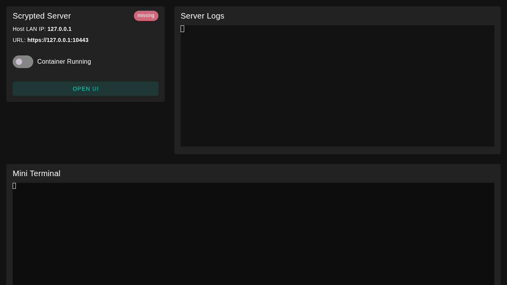

# Scrypted Server App

Desktop launcher for Scrypted on Linux built with Electron + Vue 3 + Vuetify. It provides a simple operations UI for container power control, status/IP visibility, log streaming, and an integrated shell terminal for advanced commands.



## Prerequisites

- Linux host
- Docker installed
- Your user is in the `docker` group

## Development

```bash
npm install
npm run dev
```

## Build

```bash
npm run build
```

Build artifacts are generated in `release/` as `*.AppImage` and `*.deb`.

## Releases

Tagging a commit with `server-app-vX.Y.Z` triggers
[`.github/workflows/server-app-release.yml`](../.github/workflows/server-app-release.yml),
which builds Linux AppImage + `.deb` artifacts and attaches them to a GitHub
Release.

```sh
# Cut a release
git tag server-app-v0.1.0
git push origin server-app-v0.1.0
```

To test the build without tagging, use the workflow's "Run workflow" button
on the Actions tab (`workflow_dispatch`). Artifacts will be available on the
run page but no Release will be created.

## First run behavior

If the `scrypted` container does not exist, turning the server on pulls `ghcr.io/koush/scrypted:latest`, creates the container, and starts it. Persistent data is stored in `~/.scrypted/volume`.

## Troubleshooting

- Docker socket permissions: ensure your user has Docker access (usually via `docker` group membership).
- `node-pty` rebuild issues: run `npm rebuild node-pty`.
- AppImage launch issues: install FUSE support required by your distro.

## Roadmap

A Tauri port is on the table; this Electron implementation is v1.
